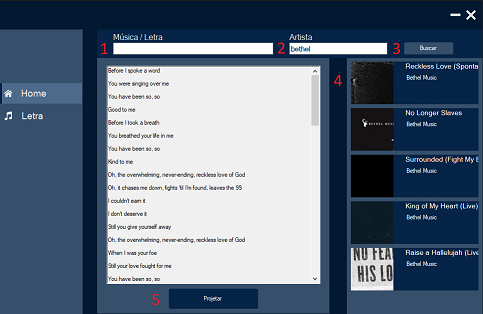
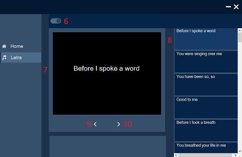

# Projetor de Letras

Aplicação feita para projetar músicas em igrejas ou situações semelhantes usando a [API do Genius](https://docs.genius.com/#account-h2).

## Preparo

### API
* Criar uma conta e posteriormente criar uma Key no [Genius](https://genius.com).
* Após isso, copie a Key, abra Lirycs\Classes\Constant.cs e cole lá dentro em:

```csharp
public const string ApiKey = "Sua Key";
```
### Hardware
* Possuir 2 monitores ou 1 monitor e um projetor
* Aperte Win + P e selecione estender

## Como usar



* Coloque o nome da música (1) e/ou nome do artista (2) e aperte buscar (3)
* Selecione a música (4)
* Se a letra estiver correta, aperte projetar(5)





* Aperte o slide button (6) para ativar ou desativar a letra no projetor ( neste caso emulado em 7)
* Selecione a parte que será projetada (8), retroceda para parte anterior (9) ou passe para a próxima (10)

## Contribuindo
Se quiser me ajudar, achar algum problema ou sugerir algo, fique á vontade.


## License
[MIT](https://choosealicense.com/licenses/mit/)